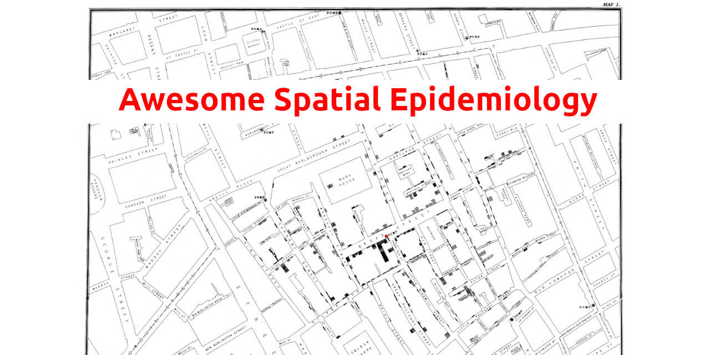

== Awesome Spatial Epidemiology
:nofooter:

*Curated list of awesome spatial epidemiology data exchange concepts,
data reference and tooling. Contributions are welcomed!*

=== GitHub topics

* *Tier 1*:
** https://github.com/topics/bioinformatics[bioinformatics]
** https://github.com/topics/disease-mapping[disease-mapping]
** https://github.com/topics/epidemic-simulations[epidemic-simulations]
** https://github.com/topics/spatial-epidemiology[spatial-epidemiology]
* *Tier 2 (scientific area)*:
** https://github.com/topics/epidemiology[epidemiology]
** https://github.com/topics/genomics[genomics]
** https://github.com/topics/infectious-diseases[infectious-diseases]
* *Tier 2 (generic tooling)*:
** https://github.com/topics/spatial-analysis[spatial-analysis]
** https://github.com/topics/geospatial-analysis[geospatial-analysis]

////
https://docs.asciidoctor.org/asciidoc/latest/tables/data-format/
////

[%header,format=csv]
|===
include::data/github-topics.hxl.csv[]
|===

=== General concepts

==== Disease diffusion (Q5282121)

____
_Disease diffusion occurs when a disease is transmitted to a new
location.[1] It implies that a disease spreads, or pours out, from a
central source._ -
https://en.wikipedia.org/wiki/Disease_diffusion_mapping
____

==== Disease ecology (Q60703450)

____
_Disease ecology is a sub-discipline of ecology concerned with the
mechanisms, patterns, and effects of host-pathogen interactions,
particularly those of infectious diseases._ –
https://en.wikipedia.org/wiki/Disease_ecology
____

==== Health geography (Q3286542)

____
_Health geography is the application of geographical information,
perspectives, and methods to the study of health, disease, and health
care._ – https://en.wikipedia.org/wiki/Health_geography
____

==== Reverse zoonosis (Q1049711)

____
_A reverse zoonosis, also known as a zooanthroponosis (Greek zoon
"`animal`", anthropos "`man`", nosos "`disease`") or anthroponosis,[1]
is a pathogen reservoired in humans that is capable of being transmitted
to non-human animals._ – https://en.wikipedia.org/wiki/Reverse_zoonosis
____

==== Spatial epidemiology (Q7574064)

____
_Spatial epidemiology is a subfield of epidemiology focused on the study
of the spatial distribution of health outcomes; it is closely related to
health geography. Specifically, spatial epidemiology is concerned with
the description and examination of disease and its geographic
variations. This is done in consideration of “demographic,
environmental, behavioral, socioeconomic, genetic, and infections risk
factors._ – https://en.wikipedia.org/wiki/Spatial_epidemiology
____

==== Synthetic data (Q7662746)

____
_Synthetic data is "`any production data applicable to a given situation
that are not obtained by direct measurement`" according to the
McGraw-Hill Dictionary of Scientific and Technical Terms;[1] where Craig
S. Mullins, an expert in data management, defines production data as
"`information that is persistently stored and used by professionals to
conduct business processes.`"_ –
https://en.wikipedia.org/wiki/Synthetic_data
____

==== Tobler’s first law of geography

____
_"`Everything is related to everything else, but near things are more
related than distant things.`"_ –
https://en.wikipedia.org/wiki/Tobler%27s_first_law_of_geography[Tobler’s
first law of geography]
____

==== Zoonosis (Q182672)

____
_A zoonosis or zoonotic disease is an infectious disease of humans
caused by a pathogen (an infectious agent, such as a bacterium, virus,
parasite or prion) that has jumped from an animal (usually a vertebrate)
to a human._ – https://en.wikipedia.org/wiki/Zoonosis
____

==== Concepts reference from software or APIs

===== OpenStreetMap

* https://www.openstreetmap.org/key
* https://wiki.openstreetmap.org/wiki/Map_features
** https://wiki.openstreetmap.org/wiki/Map_features#Healthcare_2

=== Data

____
Note: at the moment, most data here are references to be used as
reference for Synthetic Data.
____

==== UN WPP - World Population Prospects

* https://population.un.org/wpp/Download/Standard/Population/

=== Installable packages

[%header,format=csv]
|===
include::data/software.hxl.csv[]
|===

==== Synthetic Data

____
Trivia: the initial reference here is based on
https://www.activestate.com/blog/top-10-python-packages-for-creating-synthetic-data/[Top
10 Python Packages For Creating Synthetic Data]
____

===== DataSynthesizer

* https://github.com/DataResponsibly/DataSynthesizer
* https://pypi.org/project/DataSynthesizer

===== pydbgen

* https://github.com/tirthajyoti/pydbgen
* https://pypi.org/project/pydbgen

===== mimesis

* https://github.com/lk-geimfari/mimesis
* https://pypi.org/project/mimesis/

===== SDV

* https://github.com/sdv-dev/SDV
* https://sdv.dev/SDV/index.html

===== plaitpy

* https://github.com/plaitpy/plaitpy
* https://pypi.org/project/plaitpy

===== timeseries-generator

* https://github.com/Nike-Inc/timeseries-generator
* https://pypi.org/project/timeseries-generator

===== gretel-synthetics

* https://github.com/gretelai/gretel-synthetics
* https://pypi.org/project/gretel-synthetics/

===== scikit-learn

* https://github.com/scikit-learn/scikit-learn
* https://pypi.org/project/scikit-learn/

===== Mesa

* https://github.com/projectmesa/mesa
* https://pypi.org/project/Mesa/

===== zpy

* https://github.com/ZumoLabs/zpy
* https://pypi.org/project/zpy-zumo/

=== To dos

* tabular format
* OWL/TTL format

=== License

link:UNLICENSE[image:https://i.creativecommons.org/p/zero/1.0/88x31.png[Public
Domain]]

To the extent possible under law, https://github.com/fititnt[Emerson
Rocha] has waived all copyright and related or neighboring rights to
this work to link:UNLICENSE[Public Domain].